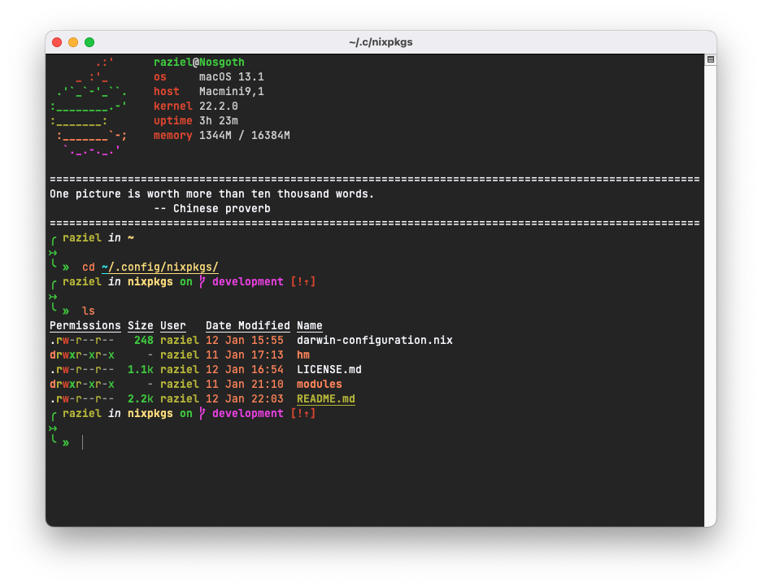

# dotfiles

## Preview




## About

These are my dotfiles for customizing MacOS.

This mostly consists of Nix toolchain:
- *Nix Package manager*
- *Home Manager*
- *Nix-Darwin*

Structure is preety stright forward:

```
.
├── darwin-configuration.nix
├── hm                          -> Everything related to Home Manager
│  ├── configs                  -> Misc stuff. These dotfiles are wrote to their proper location.
│  ├── home.nix
│  ├── pkgs                     -> Enabled nix packages.
│  └── programs                 -> Services which home manager provides for easier setup.
├── modules                     -> Modules related to Nix-Darwin.
```

---

Through the years, I have backed my dotfiles in various ways. `chezmoi` was a tool that preserved location and content of dotfiles and it provided easy way to backup/restore these dotfiles. 
When I converted everything to Nix, I didn't find
a reason to use `chezmoi` anymore although it's a great tool.
