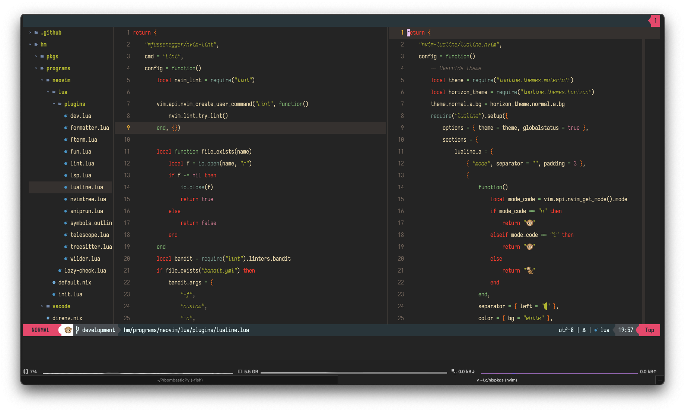

# dotfiles

## Preview



## About

These are my dotfiles for customizing MacOS.

This mostly consists of Nix toolchain:
- *Nix Package manager*
- *Home Manager*
- *Nix-Darwin*

## Installation

Few commands need to be run to set everything in this repository:

```shell
# Install Brew and Nix
# (OPTIONAL) Generate SSH keys
# Clone repo to `.config/nixpkgs`
# Add Nix channels for nixpkgs-unstable, home-manager and nix-darwin
# darwin-rebuild switch -I darwin-config=$HOME/.config/nixpkgs/darwin-configuration.nix
```

I'll try to configure more settings via `Nix-Darwin` without going down the rabbit hole.

### Project Structure

Structure is pretty straight forward:

```
.
├── darwin-configuration.nix
├── hm                          -> Everything related to Home Manager.
│  ├── configs                  -> Dotfiles which are copied to proper location.
│  ├── home.nix
│  ├── pkgs                     -> Enabled nix packages.
│  └── programs                 -> Services which home manager provides for easier setup.
├── modules                     -> Modules related to Nix-Darwin.
```

## History
---
Through the years, I have backed my dotfiles in various ways. `chezmoi` was a tool that preserved location and content of dotfiles and it provided easy way to backup/restore these dotfiles. 
When I converted everything to Nix, I didn't find
a reason to use `chezmoi` anymore although it's a great tool.
The repository used to contain a lot of secrets (such as API Keys, Shell History etc.) so I can't make it public.
The structure it provided was similar to most "dotfiles" repositories you would see around, so if you are looking
to manage your dotfiles, I suggest you try chezmoi. It have kept my dotfiles organized through many OS changes (Fedora, Manjaro, Arch, MacOS) for many years.


